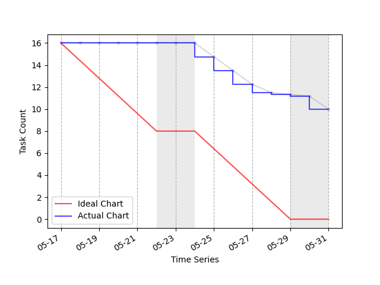

# 🔍 notion-scrum-analytics

- `notion-scrum-analytics`는 Notion의 스크럼 보드 기능을 확장해주는 Python 애플리케이션입니다.

## 미리보기



_Notion의 스크럼 보드에 기록된 태스크(유저 스토리) 카드들의 진행 현황을 자동으로 기록하고, 이를 기반으로 조직의 스프린트 별 태스크 진행 현황을 보기 쉽게 확인할 수 있습니다._

## 지원하는 기능

- [x] **일간 상태 초기화**
  - 매일 자정에 DOING 상태의 카드를 TODO로 이동시킵니다.

- [x] **일간 진행 기간 기록 자동화**
  - 매일 자정에 DOING 상태와 DONE 상태의 카드의 진행 기간을 기록합니다.

- [x] **번다운 차트 활성화, 스토리 포인트 활성화**
  - 매주 월요일 자정에 지난 스프린트 기간동안 태스크 진행 현황을 [번 다운 차트](https://ko.wikipedia.org/wiki/%EB%B2%88_%EB%8B%A4%EC%9A%B4_%EC%B0%A8%ED%8A%B8)로 시각화하고, 이를 Slack으로 전송합니다.
  - 태스크 진행 현황은 기본적으로 태스크의 갯수로 판단되며, 각 태스크 별 가중치가 필요할 경우에는 [스토리 포인트](https://en.wikipedia.org/wiki/Fibonacci_scale_(agile))를 할당할 수 있습니다.

- [x] **자동 백로그 활성화, 자동 아카이브 활성화**
  - 매주 월요일 자정에 BACKLOG 상태의 카드를 자동으로 TODO로 이동시킵니다.
  - 매주 월요일 자정에 DONE 상태의 카드를 자동으로 ARCHIVE로 이동시킵니다.
  
## 사용 방법

`notion-scrum-analytics` 에서 기본적으로 지원하는 기능은 다음과 같으며, `config.yaml` 파일을 수정하여 해당 설정을 커스터마이징할 수 있습니다.

```yml
# 옵션 활성화 설정
OPTIONS:
  # 1. 일간 상태 초기화
  # 평일 자정에 DOING 상태의 카드를 TODO로 이동시킵니다.
  DAILY_RESET: True

  # 2. 일간 진행 기간 기록 자동화
  # 평일 자정에 DOING 상태와 DONE 상태의 카드의 진행 기간을 기록합니다.
  UPDATE_DURATION: True

  # 3. 번다운 차트 활성화
  # 매주 월요일 자정에 번다운 차트를 슬랙으로 전송합니다.
  # 해당 설정을 활성화하려면 슬랙 토큰과 채널 이름을 설정해야 합니다.
  WEEKLY_BURN_CHART: True

  # 4. 스토리 포인트 활성화
  # 번다운 차트의 Y축을 스토리 포인트로 설정합니다.
  # 이 설정을 활성화하려면 태스크의 스토리 포인트 프로퍼티가 활성화 되어있어야 합니다.
  STORY_POINT_ENABLED: False

  # 5. 자동 백로그 활성화
  # 매주 월요일 자정에 BACKLOG 상태의 카드를 자동으로 TODO로 이동시킵니다.
  # 해당 설정이 활성화되어 있으려면 BACKLOG 컬럼이 존재해야 합니다.
  BACKLOG_ENABLED: False

  # 6. 자동 아카이브 활성화
  # 매주 월요일 자정에 DONE 상태의 카드를 자동으로 ARCHIVE로 이동시킵니다.
  # 해당 설정을 활성화하려면 ARCHIVE 컬럼이 존재해야 합니다.
  WEEKLY_ARCHIVE: False


# 스크럼 & 칸반 보드 관련 설정
SCRUM:
  # (필수) 보드의 인라인 페이지 URL을 아래에 붙여넣습니다.
  URL: 'https://www.notion.so/wormwlrm/bdac1d5eb89b433884c324b679ed7177?v=90e2216daf87410eb56dd319c4d82e33'
  # (필수) 스프린트 단위를 주 단위로 설정합니다.
  SPRINT_WEEK: 2
  # (필수) 태스크의 상태의 이름을 설정합니다.
  STEPS:
    # (선택) 다음 스프린트 때 진행할 태스크를 담는 컬럼입니다.
    BACKLOG: '백로그'
    # (필수) 이번 스프린트에 작업을 시작해야 하지만, 아직 시작하지 않은 태스크를 담는 컬럼입니다.
    TODO: '시작 전'
    # (필수) 이번 스프린트에서 현재 진행 중인 태스크를 담는 컬럼입니다.
    DOING: '진행 중'
    # (필수) 이번 스프린트에서 마무리된 태스크를 담는 컬럼입니다.
    DONE: '완료 🙌'
    # (선택) 지난 스프린트에서 마무리된 태스크를 담는 컬럼입니다.
    ARCHIVE: '아카이브'

# 태스크 카드 관련 프로퍼티 설정
CARD:
  # (필수) 태스크의 상태를 나타내는 프로퍼티의 이름을 설정합니다.
  # 해당 프로퍼티는 속성 유형이 `선택`이어야 합니다.
  STATUS: '상태'
  # (필수) 태스크의 작업 기간을 나타낼 프로퍼티 이름을 설정합니다.
  # 해당 프로퍼티는 속성 유형이 `날짜`여야 합니다.
  DURATION: '작업기간'
  # (선택) 태스크에 할당된 스토리 포인트가 있는 경우 해당 프로퍼티의 이름을 설정합니다.
  # 해당 프로퍼티는 속성 유형이 `숫자`여야 합니다.
  STORY_POINTS: '스토리포인트'

# 슬랙 관련 설정
SLACK:
  # (선택) 번다운 차트를 공유받을 슬랙 채널 이름입니다.
  CHANNEL_NAME: '#슬랙-봇-테스트'
```

## 유의 사항

- `notion-scrum-analytics`는 Github Actions의 Cron을 이용하고 있기 때문에, Cron에서 매주마다 아닌 N주마다 반복하는 로직은 아직 지원하지 않습니다.
